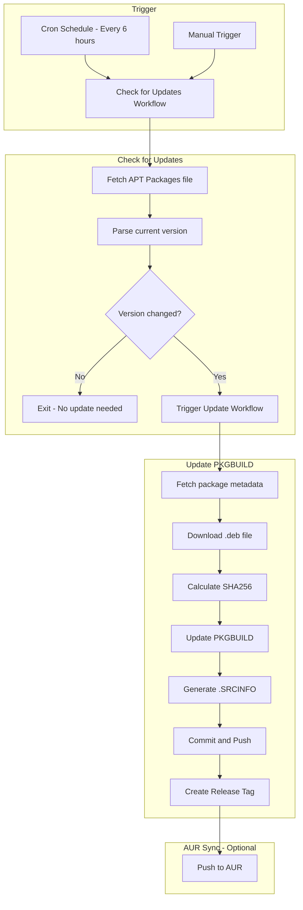

# Windsurf-Next AUR Package Automation Architecture

## Overview

This document describes the automated update system for the windsurf-next AUR package, migrating from unpredictable tar.gz URLs to the stable Debian APT repository.

## Problem Statement

The current approach uses tar.gz files with URLs that contain commit hashes:
```
https://windsurf-stable.codeiumdata.com/linux-x64/next/{COMMIT_HASH}/Windsurf-linux-x64-{VERSION}.tar.gz
```

This makes automatic updates impossible because the commit hash cannot be predicted.

## Solution

Use the Debian APT repository which has a predictable structure:
- **Base URL**: `https://windsurf-stable.codeiumdata.com/mQfcApCOdSLoWOSI/apt`
- **Packages file**: `dists/next/main/binary-amd64/Packages`
- **Package pool**: `pool/main/w/windsurf-next/`

The Packages file contains structured metadata including:
- Version number
- Filename (path to .deb)
- SHA256 checksum
- Dependencies

## Architecture Diagram



## File Structure

```
windsurf-next/
├── .github/
│   ├── workflows/
│   │   ├── check-updates.yml      # Monitors for new releases
│   │   └── update-pkgbuild.yml    # Updates PKGBUILD when triggered
│   └── scripts/
│       ├── fetch-version.sh       # Fetches latest version from APT repo
│       └── update-pkgbuild.sh     # Updates PKGBUILD with new version
├── PKGBUILD                       # Modified to use .deb source
├── .SRCINFO                       # Auto-generated
├── windsurf-next.desktop
├── windsurf-next-url-handler.desktop
├── ARCHITECTURE.md                # This document
└── README.md                      # Updated with automation info
```

## PKGBUILD Changes

### Current Approach (tar.gz)
```bash
source=("$_pkgfilename::https://...unpredictable-url.../Windsurf-linux-x64-{version}.tar.gz")
```

### New Approach (.deb)
```bash
# APT repository base URL
_apt_base="https://windsurf-stable.codeiumdata.com/mQfcApCOdSLoWOSI/apt"

# Constructed from Packages file metadata
source=("windsurf-next-${pkgver}.deb::${_apt_base}/pool/main/w/windsurf-next/Windsurf-linux-x64-${_upstream_ver}.deb")
```

The .deb file is an ar archive containing:
- `debian-binary` - Debian format version
- `control.tar.*` - Package metadata
- `data.tar.*` - Actual files

We extract `data.tar.*` to get the application files.

## GitHub Actions Workflows

### 1. Check Updates Workflow (`check-updates.yml`)

**Triggers:**
- Cron schedule (every 6 hours)
- Manual workflow_dispatch

**Steps:**
1. Fetch the APT Packages file
2. Parse the current version
3. Compare with version in PKGBUILD
4. If different, trigger update workflow

### 2. Update PKGBUILD Workflow (`update-pkgbuild.yml`)

**Triggers:**
- Called by check-updates workflow
- Manual workflow_dispatch with version input

**Steps:**
1. Fetch complete package metadata from APT repo
2. Download the .deb file
3. Verify SHA256 checksum
4. Update PKGBUILD with new version and checksum
5. Generate .SRCINFO using `makepkg --printsrcinfo`
6. Commit and push changes
7. Create a git tag for the release

## Version Format Handling

APT version: `1.12.157+next.10ebfa84f4-1764862834`

Arch package version: `1.12.157_next.10ebfa84f4` (underscores, no epoch)

Conversion logic:
```bash
# From APT version to pkgver
apt_version="1.12.157+next.10ebfa84f4-1764862834"
pkgver=$(echo "$apt_version" | sed 's/+/_/g; s/-[0-9]*$//')
# Result: 1.12.157_next.10ebfa84f4
```

## Security Considerations

1. **Checksum Verification**: Always verify SHA256 from APT Packages file
2. **GPG Signature**: The APT repo is signed; we can verify the Release file
3. **GitHub Secrets**: Store any sensitive data (AUR SSH keys) as encrypted secrets

## Optional: AUR Push Automation

If desired, the workflow can automatically push to AUR:

1. Store AUR SSH private key as GitHub secret
2. Clone AUR repo after updates
3. Copy updated files
4. Commit and push to AUR

This requires initial setup with AUR maintainer credentials.

## Implementation Checklist

- [ ] Create `.github/workflows/check-updates.yml`
- [ ] Create `.github/workflows/update-pkgbuild.yml`
- [ ] Create `.github/scripts/fetch-version.sh`
- [ ] Create `.github/scripts/update-pkgbuild.sh`
- [ ] Update PKGBUILD to use .deb source
- [ ] Update README.md with automation documentation
- [ ] Test the complete workflow
- [ ] (Optional) Set up AUR push automation

---

## Detailed Implementation Specifications

### New PKGBUILD Design

```bash
# Maintainer: Webarch <contact@webarch.ro>
# Auto-updated by GitHub Actions

pkgname=windsurf-next
# Version format: major.minor.patch_next.commithash
pkgver=1.12.157_next.10ebfa84f4
pkgrel=1
pkgdesc="Windsurf-next - Next version of the Windsurf editor"
arch=('x86_64')
url="https://windsurf.com"
license=('custom')
depends=(
    'vulkan-driver'
    'ffmpeg'
    'glibc'
    'libglvnd'
    'gtk3'
    'alsa-lib'
)
makedepends=('curl')
optdepends=(
    'bash-completion: for bash shell completions'
    'zsh: for zsh shell completions'
)
provides=("$pkgname")
conflicts=("$pkgname")
options=('!strip')

# APT repository configuration
_apt_base="https://windsurf-stable.codeiumdata.com/mQfcApCOdSLoWOSI/apt"
# Upstream version format: 1.12.157+next.10ebfa84f4 (from Packages file)
_upstream_ver="${pkgver//_/+}"
# Deb filename from APT pool
_debfile="Windsurf-linux-x64-${_upstream_ver}.deb"

source=(
    "${pkgname}-${pkgver}.deb::${_apt_base}/pool/main/w/windsurf-next/${_debfile}"
    'windsurf-next.desktop'
    'windsurf-next-url-handler.desktop'
)
sha256sums=('a3430e8252526182ed4ae1ee9697008bba36fed216954be97af307a2ed16e7ca'
            '0561a3546b31291d43138b1f51e9696d889b37d0e88966c9bd32307d4536f91a'
            '7bcdc177ae93096a04076ddf519b836dddf3a11a49e19bfca80f6bf5e60f91b2')

prepare() {
    cd "$srcdir"
    
    # Extract the .deb file (ar archive)
    mkdir -p deb-extract
    cd deb-extract
    ar x "../${pkgname}-${pkgver}.deb"
    
    # Extract the data archive (contains the actual files)
    mkdir -p data
    # Handle both .tar.xz and .tar.zst formats
    if [[ -f data.tar.xz ]]; then
        tar -xf data.tar.xz -C data
    elif [[ -f data.tar.zst ]]; then
        tar -xf data.tar.zst -C data
    elif [[ -f data.tar.gz ]]; then
        tar -xf data.tar.gz -C data
    fi
}

package() {
    cd "$srcdir/deb-extract/data"
    
    # The deb extracts to usr/share/windsurf-next/
    # Copy all files to /opt for consistency with current package
    install -dm755 "$pkgdir/opt/$pkgname"
    cp -r usr/share/windsurf-next/* "$pkgdir/opt/$pkgname/"
    
    # Create symlink for the executable
    install -dm755 "$pkgdir/usr/bin"
    ln -sf "/opt/$pkgname/windsurf-next" "$pkgdir/usr/bin/$pkgname"

    # Install the desktop entry files
    install -Dm644 "$srcdir/$pkgname.desktop" "$pkgdir/usr/share/applications/$pkgname.desktop"
    install -Dm644 "$srcdir/$pkgname-url-handler.desktop" "$pkgdir/usr/share/applications/$pkgname-url-handler.desktop"

    # Install bash completion
    if [[ -f "$pkgdir/opt/$pkgname/resources/completions/bash/$pkgname" ]]; then
        install -Dm644 "$pkgdir/opt/$pkgname/resources/completions/bash/$pkgname" \
            "$pkgdir/usr/share/bash-completion/completions/$pkgname"
    fi
    
    # Install zsh completion
    if [[ -f "$pkgdir/opt/$pkgname/resources/completions/zsh/_$pkgname" ]]; then
        install -Dm644 "$pkgdir/opt/$pkgname/resources/completions/zsh/_$pkgname" \
            "$pkgdir/usr/share/zsh/site-functions/_$pkgname"
    fi
    
    # Install icon
    install -Dm644 "$pkgdir/opt/$pkgname/resources/app/resources/linux/code-next.png" \
        "$pkgdir/usr/share/pixmaps/$pkgname.png"
    
    # Fix permissions
    chmod 755 "$pkgdir/opt/$pkgname/$pkgname"
    chmod 4755 "$pkgdir/opt/$pkgname/chrome-sandbox"
}
```

### fetch-version.sh Script

```bash
#!/bin/bash
# Fetches the latest version info from the APT repository
# Outputs: VERSION FILENAME SHA256

set -euo pipefail

APT_BASE="https://windsurf-stable.codeiumdata.com/mQfcApCOdSLoWOSI/apt"
PACKAGES_URL="$APT_BASE/dists/next/main/binary-amd64/Packages"

# Fetch the Packages file
packages_content=$(curl -sL "$PACKAGES_URL")

# Parse required fields
version=$(echo "$packages_content" | grep -m1 "^Version:" | cut -d' ' -f2)
filename=$(echo "$packages_content" | grep -m1 "^Filename:" | cut -d' ' -f2)
sha256=$(echo "$packages_content" | grep -m1 "^SHA256:" | cut -d' ' -f2)

# Convert version to Arch format (replace + with _, remove epoch after -)
# APT: 1.12.157+next.10ebfa84f4-1764862834
# Arch: 1.12.157_next.10ebfa84f4
arch_version=$(echo "$version" | sed 's/+/_/g; s/-[0-9]*$//')

echo "APT_VERSION=$version"
echo "ARCH_VERSION=$arch_version"
echo "FILENAME=$filename"
echo "SHA256=$sha256"
echo "DOWNLOAD_URL=$APT_BASE/$filename"
```

### update-pkgbuild.sh Script

```bash
#!/bin/bash
# Updates PKGBUILD with new version information
# Usage: ./update-pkgbuild.sh <arch_version> <sha256>

set -euo pipefail

NEW_VERSION="$1"
NEW_SHA256="$2"

PKGBUILD_FILE="PKGBUILD"

# Update pkgver
sed -i "s/^pkgver=.*/pkgver=$NEW_VERSION/" "$PKGBUILD_FILE"

# Reset pkgrel to 1 for new version
sed -i "s/^pkgrel=.*/pkgrel=1/" "$PKGBUILD_FILE"

# Update the first sha256sum (the .deb file)
# This is a bit complex due to the multi-line sha256sums array
# Using awk for more reliable editing
awk -v sha="$NEW_SHA256" '
/^sha256sums=/ {
    # Print the opening
    print "sha256sums=(\x27" sha "\x27"
    in_sha=1
    next
}
in_sha && /\x27[a-f0-9]{64}\x27/ {
    # Print remaining checksums as-is
    if (++count > 1 || !/^sha256sums=/) {
        print
    }
}
in_sha && /\)/ {
    in_sha=0
}
!in_sha { print }
' "$PKGBUILD_FILE" > "$PKGBUILD_FILE.tmp" && mv "$PKGBUILD_FILE.tmp" "$PKGBUILD_FILE"

echo "Updated PKGBUILD to version $NEW_VERSION"
```

### check-updates.yml Workflow

```yaml
name: Check for Updates

on:
  schedule:
    # Run every 6 hours
    - cron: '0 */6 * * *'
  workflow_dispatch:
    # Allow manual trigger

jobs:
  check:
    runs-on: ubuntu-latest
    outputs:
      has_update: ${{ steps.check.outputs.has_update }}
      new_version: ${{ steps.check.outputs.new_version }}
      sha256: ${{ steps.check.outputs.sha256 }}
    
    steps:
      - name: Checkout repository
        uses: actions/checkout@v4
      
      - name: Get current version from PKGBUILD
        id: current
        run: |
          current_version=$(grep "^pkgver=" PKGBUILD | cut -d'=' -f2)
          echo "version=$current_version" >> $GITHUB_OUTPUT
      
      - name: Fetch latest version from APT repo
        id: latest
        run: |
          APT_BASE="https://windsurf-stable.codeiumdata.com/mQfcApCOdSLoWOSI/apt"
          PACKAGES_URL="$APT_BASE/dists/next/main/binary-amd64/Packages"
          
          packages_content=$(curl -sL "$PACKAGES_URL")
          
          apt_version=$(echo "$packages_content" | grep -m1 "^Version:" | cut -d' ' -f2)
          sha256=$(echo "$packages_content" | grep -m1 "^SHA256:" | cut -d' ' -f2)
          
          # Convert to Arch version format
          arch_version=$(echo "$apt_version" | sed 's/+/_/g; s/-[0-9]*$//')
          
          echo "apt_version=$apt_version" >> $GITHUB_OUTPUT
          echo "arch_version=$arch_version" >> $GITHUB_OUTPUT
          echo "sha256=$sha256" >> $GITHUB_OUTPUT
      
      - name: Compare versions
        id: check
        run: |
          current="${{ steps.current.outputs.version }}"
          latest="${{ steps.latest.outputs.arch_version }}"
          
          echo "Current version: $current"
          echo "Latest version: $latest"
          
          if [[ "$current" != "$latest" ]]; then
            echo "has_update=true" >> $GITHUB_OUTPUT
            echo "new_version=$latest" >> $GITHUB_OUTPUT
            echo "sha256=${{ steps.latest.outputs.sha256 }}" >> $GITHUB_OUTPUT
            echo "Update available: $current -> $latest"
          else
            echo "has_update=false" >> $GITHUB_OUTPUT
            echo "No update available"
          fi
  
  update:
    needs: check
    if: needs.check.outputs.has_update == 'true'
    uses: ./.github/workflows/update-pkgbuild.yml
    with:
      version: ${{ needs.check.outputs.new_version }}
      sha256: ${{ needs.check.outputs.sha256 }}
    secrets: inherit
```

### update-pkgbuild.yml Workflow

```yaml
name: Update PKGBUILD

on:
  workflow_call:
    inputs:
      version:
        description: 'New package version in Arch format'
        required: true
        type: string
      sha256:
        description: 'SHA256 checksum of the .deb file'
        required: true
        type: string
  
  workflow_dispatch:
    inputs:
      version:
        description: 'New package version in Arch format (e.g., 1.12.157_next.10ebfa84f4)'
        required: true
        type: string
      sha256:
        description: 'SHA256 checksum of the .deb file'
        required: true
        type: string

jobs:
  update:
    runs-on: ubuntu-latest
    
    steps:
      - name: Checkout repository
        uses: actions/checkout@v4
        with:
          token: ${{ secrets.GITHUB_TOKEN }}
      
      - name: Update PKGBUILD
        run: |
          NEW_VERSION="${{ inputs.version }}"
          NEW_SHA256="${{ inputs.sha256 }}"
          
          # Update pkgver
          sed -i "s/^pkgver=.*/pkgver=$NEW_VERSION/" PKGBUILD
          
          # Reset pkgrel to 1
          sed -i "s/^pkgrel=.*/pkgrel=1/" PKGBUILD
          
          # Update the .deb sha256sum (first entry in sha256sums array)
          # Extract current desktop file checksums
          desktop_sha=$(grep -A3 "^sha256sums=" PKGBUILD | tail -2 | head -1 | tr -d " '")
          handler_sha=$(grep -A3 "^sha256sums=" PKGBUILD | tail -1 | tr -d " ')")
          
          # Rebuild sha256sums array
          sed -i "/^sha256sums=/,/)$/c\\sha256sums=('$NEW_SHA256'\n            '$desktop_sha'\n            '$handler_sha')" PKGBUILD
          
          echo "Updated PKGBUILD to version $NEW_VERSION"
          cat PKGBUILD
      
      - name: Install Arch Linux tools
        run: |
          # We need makepkg to generate .SRCINFO
          # Using a container or installing pacman-package-manager
          sudo apt-get update
          sudo apt-get install -y libarchive-tools
          
          # Download makepkg script (standalone version)
          curl -sL https://raw.githubusercontent.com/archlinux/pacman/master/scripts/makepkg.sh.in > /tmp/makepkg
          chmod +x /tmp/makepkg
      
      - name: Generate .SRCINFO
        run: |
          # Generate .SRCINFO using makepkg --printsrcinfo
          # Since we're on Ubuntu, we'll parse PKGBUILD manually
          
          # Simple .SRCINFO generator
          source PKGBUILD
          
          cat > .SRCINFO << EOF
          pkgbase = $pkgname
          	pkgdesc = $pkgdesc
          	pkgver = $pkgver
          	pkgrel = $pkgrel
          	url = $url
          	arch = ${arch[0]}
          	license = $license
          EOF
          
          for dep in "${makedepends[@]}"; do
            echo "	makedepends = $dep" >> .SRCINFO
          done
          
          for dep in "${depends[@]}"; do
            echo "	depends = $dep" >> .SRCINFO
          done
          
          for dep in "${optdepends[@]}"; do
            echo "	optdepends = $dep" >> .SRCINFO
          done
          
          echo "	provides = ${provides[0]}" >> .SRCINFO
          echo "	conflicts = ${conflicts[0]}" >> .SRCINFO
          echo "	options = ${options[0]}" >> .SRCINFO
          
          for src in "${source[@]}"; do
            echo "	source = $src" >> .SRCINFO
          done
          
          for sum in "${sha256sums[@]}"; do
            echo "	sha256sums = $sum" >> .SRCINFO
          done
          
          echo "" >> .SRCINFO
          echo "pkgname = $pkgname" >> .SRCINFO
          
          cat .SRCINFO
      
      - name: Commit and push changes
        run: |
          git config user.name "github-actions[bot]"
          git config user.email "github-actions[bot]@users.noreply.github.com"
          
          git add PKGBUILD .SRCINFO
          git commit -m "Update to version ${{ inputs.version }}"
          git push
      
      - name: Create release tag
        run: |
          git tag "v${{ inputs.version }}"
          git push origin "v${{ inputs.version }}"
      
      - name: Create GitHub Release
        uses: softprops/action-gh-release@v1
        with:
          tag_name: v${{ inputs.version }}
          name: "windsurf-next ${{ inputs.version }}"
          body: |
            Automated update to windsurf-next version ${{ inputs.version }}
            
            SHA256: `${{ inputs.sha256 }}`
          draft: false
          prerelease: false
```

---

## Summary

This architecture provides:

1. **Reliable version detection** - Using the stable APT repository structure
2. **Automated monitoring** - GitHub Actions check every 6 hours
3. **Automatic updates** - PKGBUILD and .SRCINFO are updated automatically
4. **Version tagging** - Each update creates a git tag and GitHub release
5. **Manual override** - Workflows can be triggered manually if needed

The migration from tar.gz to .deb is transparent to end users - the package still installs the same way and provides the same files.